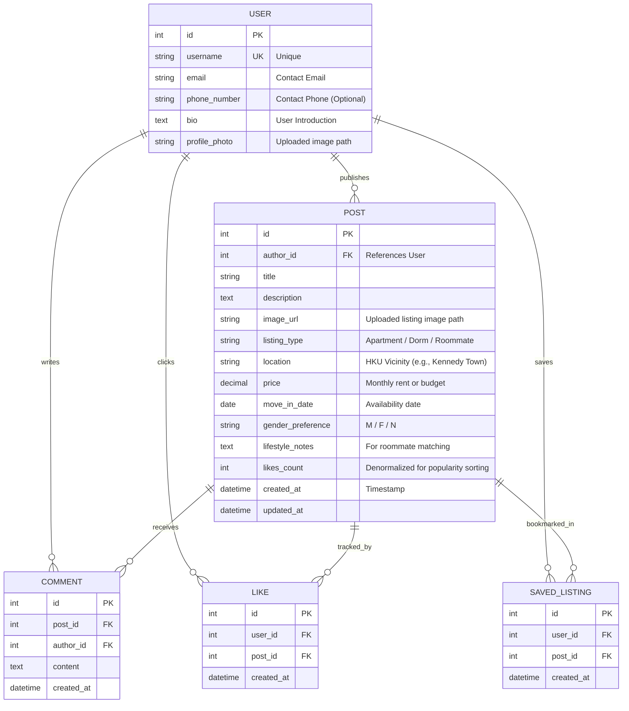

# RoomieHKU Database Schema Documentation

## 1. Overview
The RoomieHKU database is designed to provide a structured and efficient platform for HKU students to find housing and roommates. Built with **Django ORM** and backed by **SQLite**, the schema emphasizes relational integrity, social engagement (likes/comments), and high-performance listing discovery.

---

## 2. Entity Relationship Diagram (ERD)
The following diagram illustrates the core relationships between users, listings, and social interactions.

## 3. Detailed Model Breakdown

### A. User Model
*   **Base**: Extends Django's `AbstractUser`.
*   **Key Fields**:
    *   **username**: Unique identifier for authentication (built-in).
    *   **phone_number**: Stores contact details for interested parties (formatted as `CharField` to support international prefixes and leading zeros).
    *   **profile_photo**: Implemented as an uploaded media file field (`profile_photos/`).

### B. Post Model (Listing Engine)
*   **Function**: A unified model handling "Housing Offers" and "Roommate Requests."
*   **Business Logic**:
    *   **listing_type**: Categorizes posts into Apartment, Dorm, or Roommate Request.
    *   **price**: Stored as `DecimalField` to ensure financial precision for rents/budgets.
    *   **gender_preference & lifestyle_notes**: Critical fields for roommate compatibility matching.
*   **Optimization**:
    *   **likes_count**: A denormalized field updated via signals or views to allow instant "Sort by Popularity" without expensive SQL `COUNT` aggregations.
    *   **ordering**: Defaulted to `-created_at` to prioritize the freshest content in the feed.

### C. Social & Interaction Models
*   **Comment**: Linked to both `Post` and `User` with `CASCADE` deletion to maintain database cleanliness.
*   **Like**: Maps the many-to-many relationship between users and posts they enjoy.
    *   *Constraint*: `UniqueConstraint(fields=['user', 'post'])` prevents duplicate likes from the same user.
*   **SavedListing**: Allows users to bookmark listings for future reference.
    *   *Constraint*: `UniqueConstraint(fields=['user', 'post'])` prevents duplicate saves for the same post.

---

## 4. Analytical Capabilities

The schema is pre-configured to support platform analytics:
*   **Popularity Trends**: High-speed querying of trending content via the `likes_count` field.
*   **User Engagement**: Measuring platform activity by grouping `Comment` and `Post` counts by `author_id`.
*   **Geographic Insights**: Identifying high-demand areas by aggregating listings by the `location` field.
*   **User Preference**: By cross-referencing `Likes` and `SavedListings` with `Post` attributes (such as `location`,
`price`, and `listing_type`), the system can analyze individual user behavior. This enables the platform to identify 
popular price brackets, high-demand locations, and common compatibility trends for future personalized recommendations.
